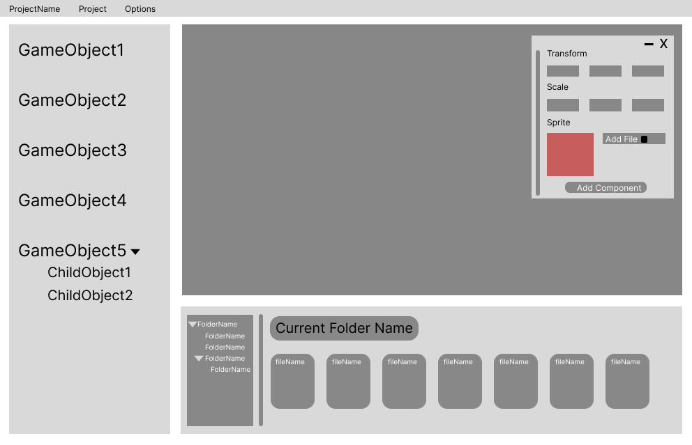
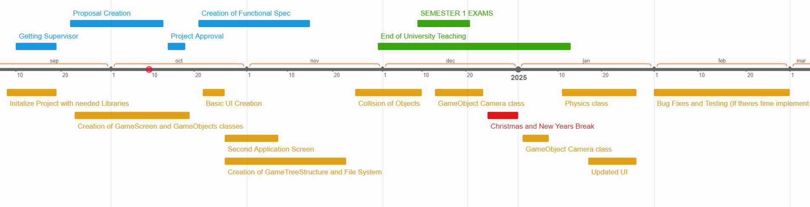

# School of Computing &mdash; Year 4 Project Proposal Form

## SECTION A

|                     |                   |
|---------------------|-------------------|
|Project Title:       | HoneyMoon Engine            |
|Student 1 Name:      | Ivan Shvydchenko            |
|Student 1 ID:        | 21317061           |
|Student 2 Name:      | Jibran Jarwar            |
|Student 2 ID:        | 21353811            |
|Project Supervisor:  | Renaat Verbrugger            |

## SECTION B

### Introduction

This Project revolves around making a 2D Game Engine called HoneyMoon Engine. The 2D Game Engine provides a way for developers to create their own games using the Lua programming language and provide them with tools to be able to render objects, cameras, physics and among other things.

### Outline

The HoneyMoon Engine will be able to be run as an executable on the user's local machine. As a 2D game engine it will provide the aforementioned physics, camera control, movement, native scripting and design elements. Our Game Engine serves as an introduction to the world of game development. Game engines such as unity are filled with an overwhelming amount of features. Our main focus for this game engine will be integrating Lua for Native scripting so developers have an easier time coding simpler code while we do the heavy lifting in C++, everything else will be tools for the game engine to function how its suppose to.

### Background

The Idea behind HoneyMoon Engine was inspired by other game engines which include: Unity, GameMaker Studio, Godot, RPG maker. Both of us also enjoy playing games and have a passion for game developement which is why we took the interest in wanting to learn and create our own architecture for a game engine to better understand the development behind it all.

### Achievements

**Ranked in terms of importance**
1. Be able to create scripts in Lua which are processed by C++ in which the game Engine will be written in.
2. Render multiple Objects.
3. Have collision between Objects.
4. Tree Structure for Multiple Game Objects under one Game Object.
5.  Working Cameras.
6. Some Physics support.
7. Some Animation support.

	**Users**:
  
    - The Users will be game developers who are comfortable coding in Lua or who would like to learn Lua while creating a game for imersive learning. 
    - Users who want an introduction to the basics of a using a game engine and game development.

### Justification

As mentioned above, game engines such as Unity are filled with an enormous amount of customization and utilities. This makes it extremely difficult to use as learning unity is a skill in itself. Our game engine, while simpler, provides a far less intimidating barrier to entry while also providing a base layer of game design (base layer meaning key functionalities).  As well as this we play games and want to understand what goes into making them. We also think that it is a great way to improve upon our OO Design because of the different classes we will be creating for easy use for the developers creating the games in Lua while we would be doing the heavy lifting when creating the game engine.

### Programming language(s)

- C++
- Lua
- Javascript

### Programming tools / Tech stack

- SDL for rendering and handling window events
- ImGUI for Game Engine UI
- MINGW32 for compiling C++ code
- Visual Studio Code as the IDE
- Git for Version Control
- LuaCpp API for integrating Lua with C++
- Jira for tracking tickets

### Hardware

- Modern Computer or Laptop

### Learning Challenges

- Learning to use C++ and Lua
- The architecture behind Game Engines
- Creating a Makefile
- Writing a pipeline for continous integration
- Better Understanding of Tree Structures
- Better Understanding of OO Design
- Learning our tech stack

### Breakdown of work

Our Team will collaborate closely throughtout this project by holding weekly meetings. We will follow agile practises to manage the workload in the most efficient and effective way possible. We will be using Jira as our tracking system where we can priorties and manage tasks that we will be spliting between each other. As work progresses the work can be split by coding the different classes needed to work for example the Game Object class and the Camera Object class, we will also leave comments for each other while implementing these functionalities in case the other picks up a certain class that needs some function implemented that the other can't do in that moment.

## Sample mock wireframe: UI example 

## Planned Schedule for 4th Year Project

